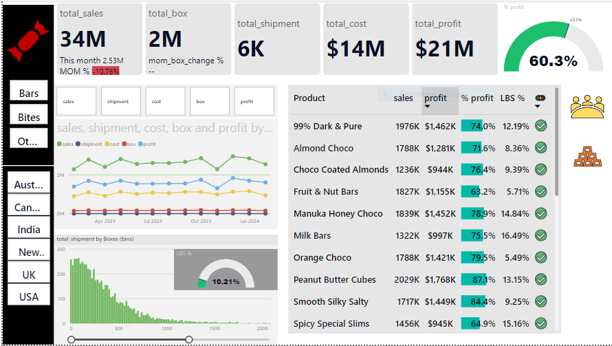
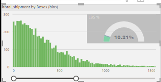
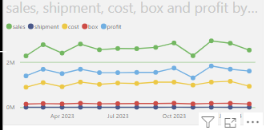
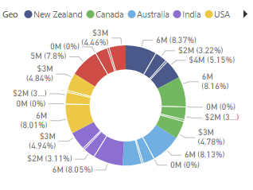

# 📊 Sales Data Analysis Dashboard for Awesome Chocolate

**Role**: Data Analyst  
**Technologies**: Power BI, Power Query, DAX, Data Cleaning, Data Visualization  
**Data Source**: Excel Dataset for Awesome Chocolate Sales  
**Tutorial Reference**: [YouTube Video Tutorial](https://youtu.be/ooJO7NW4uJU?si=V0W2xVqev2UzUkXq)

## 🚀 Project Overview

As part of my learning journey to transition into a Data Analyst role, I completed a sales analysis project for a fictional chocolate company called "Awesome Chocolate." This project was a follow-along practice from a [YouTube video tutorial](https://youtu.be/ooJO7NW4uJU?si=V0W2xVqev2UzUkXq). The aim of the project was to derive insights into sales performance, customer behavior, and regional trends. I used Power BI to create a comprehensive dashboard that allows stakeholders to explore key metrics and make data-driven business decisions.

  
*Placeholder for Power BI Dashboard*

---

## 🎯 Objective

To analyze the sales data of "Awesome Chocolate" and provide actionable insights to improve decision-making for the sales and marketing teams. This project helps identify:

- **Chcolate sales analysis.**
- **sales person and product performance.**
- **Low box shipment analysis.**
- **Month on month Totalsales changes.**

---

## 🔧 Key Features

### 1. Data Import and Modeling 
- **Power Query** was used to transform the dataset:
  - Transformed fields such as `Invoice Date`, and   `Cost` for better usability.
  - data relationship by Data Modeling

### 2. Sales Metrics Analysis
Using **DAX calculations**:
- **Total Sales**: Sum of all sales transactions.
- **Low box shipment%**: Calculated as total shipment  divided by the total boxes.
- **Sales by Product**: Analysis of which chocolate products generated the highest profit.

DAX code for total sales calculation:  
\`\`\`dax
TotalSales = SUM(shipments[Sales])
\`\`\`

### 3. Key Metrics
- **Top Products**: Identified products contributing the most to profit.
- **Regional Performance**: Analyzed sales distribution across different geographic regions.

### 4. Data Visualization
The dashboard includes the following visual elements:
- **Bar Charts** showing total shipment by boxes.
- **Line Charts** to track monthly trends of all the KPI.
- **KPI Cards** highlighting key business metrics such as total sales, total shipment, total boxes , total cost and total profit.

  
*Sales by Product Category*

  
*Monthly Sales Trends*

### 5. Advanced Analysis
- **Product Segmentation**: Grouping products based on sales performance.
- **sales person Insights**: Analysis of sale persons  patterns and identifying potential growth opportunities.

---

## 📈 Dashboard Components

- **Bar Chart**: Comparison of sales across different product categories.
- **KPI Cards**: Key metrics like total sales, total shipment, total box, total cost, total profit and LBS %
- **Line Chart**: Monthly trends to visualize seasonality.
- **Donut tool tip**: Geographic distribution of sales for targeted regional marketing.

  
*Geographic Distribution of Sales*

---

## 🛠️ Technologies and Tools Used

- **Power BI** for dashboard creation and data visualization.
- **Power Query** for transforming data.
- **DAX** (Data Analysis Expressions) for advanced calculations and metrics.

---

## 🔍 Insights & Recommendations

- **Promotional Campaigns**: Focus on regions with high sales for upcoming product launches.
- **Product Focus**: Increase inventory of top-selling products before high-demand seasons.
- **Targeted Advertising**: Utilize sales trends to target specific regions.

---

## 👥 Project Collaboration

The project was self-directed and part of my learning as an aspiring data analyst. It was completed as a follow-along practice from this [YouTube video tutorial](https://youtu.be/ooJO7NW4uJU?si=V0W2xVqev2UzUkXq). This dashboard is designed to be a useful tool for both **sales and marketing teams** to derive insights and improve overall business performance.

---

**[Download Power BI Dashboard](https://app.powerbi.com/view?r=eyJrIjoiNDBmOWQyMWQtMzk4ZC00MTI1LWE2YWEtZTEzNjAzOTU1NWQwIiwidCI6ImM2ZTU0OWIzLTVmNDUtNDAzMi1hYWU5LWQ0MjQ0ZGM1YjJjNCJ9)**

---

**Made by Vidyalaxmi Mallya**
